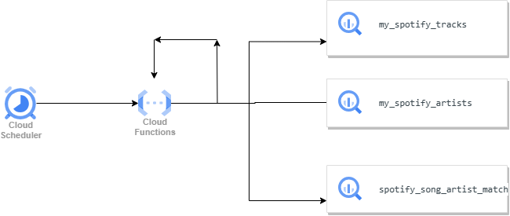

# Spotify Playlist Database Pipeline

## Overview

This project aims to preserve your Spotify liked songs by storing their details in a database, even if they get removed from Spotify due to licensing issues or any other reason. The setup is implemented in the Google Cloud environment, utilizing Cloud Functions scheduled to run weekly. Each execution retrieves 20 saved songs from Spotify's API, checks for their existence in BigQuery, and stores their details across three tables if they're not already present. This process is then triggered to continue, ensuring a persistent collection of your favorite tracks, alongside artist details and their association with tracks.

## Prerequisites

Before setting up the pipeline, ensure you have the following:

- A Google Cloud account with BigQuery and Cloud Functions enabled.
- A Spotify account and access to the Spotify API.

## Setup Guide

### Step 1: Create BigQuery Tables

Create three tables in BigQuery with the following schemas:

- `SPOTIFY_TRACKS_TABLE`: Stores details of tracks.
- `ARTISTS_TABLE`: Stores artist details.
- `ARTIST_TRACKS_TABLE`: Stores the mapping between artists and tracks.

Refer to the provided schema definitions in the code for column details.

### Step 2: Register a Spotify Application

1. Visit the Spotify Developer Dashboard and create a new application.
2. Note down the `client_id` and `client_secret` provided upon application creation.

### Step 3: Obtain Spotify API Tokens

1. First run `authorize_spotify.py`, copy the code from the redirected URI.
2. Next, run `get_access_token.py` to generate an API token and refresh token.
3. Store these tokens in Google Secret Manager for secure access.

### Step 4: Deploy Cloud Function

1. Create a Cloud Function in Google Cloud, configuring it to run weekly.
2. Set the environment variables within your Cloud Function.
3. Copy the `cloudfunction_main.py` code to the cloud function. Also, copy the `requirements.txt`.
4. Once deployed, the Cloud Function will automatically run on a weekly schedule, fetching new saved tracks from your Spotify account and updating the BigQuery tables. This setup ensures that your favorite songs are preserved in a database, maintaining your collection irrespective of changes in Spotify's library.

## Architecture

